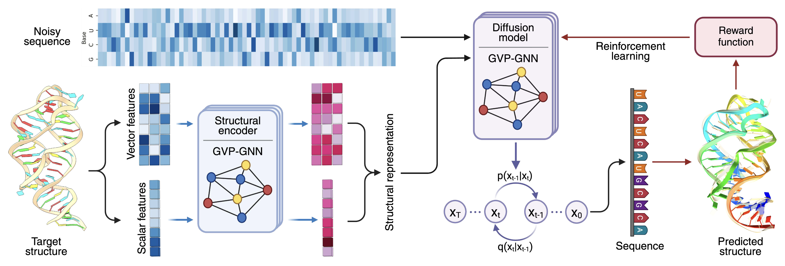

# RIDER: 3D RNA Inverse Design with Reinforcement Learning–Guided Diffusion

RIDER is an **RNA tertiary-structure inverse design** framework that combines generative diffusion models with reinforcement learning. By directly optimizing structural consistency during fine-tuning, RIDER significantly improves the structural fidelity of designed RNA sequences, making them more likely to fold into the intended 3D structures.



This is the official code repository for the **ICLR 2026** paper *"RIDER: 3D RNA Inverse Design with Reinforcement Learning–Guided Diffusion".*

RIDER is a two-stage framework for RNA tertiary-structure inverse design. It consists of a diffusion-based sequence generator (RIDE) and a reinforcement learning fine-tuning module (RIDER).

1. **RIDE: RNA sequence generation with diffusion models**  
   A conditional diffusion model that generates nucleotide sequences by denoising corrupted inputs, conditioned on target structural information.

2. **RIDER: RNA inverse design with reinforcement learning–guided optimization**
   A reinforcement learning module built on top of RIDE.  
   It fine-tunes generated sequences by optimizing a reward based on 3D structural self-consistency, encouraging the sequences to fold into the intended RNA tertiary structures.

---

## Installation

### 1) Create environment and install PyTorch

Install a PyTorch build that matches your CUDA.

```bash
conda create -n rna-rl python=3.10 -y
conda activate rna-rl

# Example for CUDA 11.8 (adjust if needed)
conda install pytorch torchvision torchaudio pytorch-cuda=11.8 -c pytorch -c nvidia -y
```

### 2) Install PyTorch Geometric and other dependencies

Please refer to the official **[PyTorch Geometric (PyG)](https://pytorch-geometric.readthedocs.io/en/latest/)** documentation for detailed installation instructions.  
Make sure to select the appropriate commands according to your **PyTorch version, operating system, and CUDA version**.


```bash
pip install torch_geometric
pip install torch_scatter torch_cluster -f https://data.pyg.org/whl/torch-2.1.2+cu118.html
# PyG must match your torch and CUDA versions.

pip install wandb python-dotenv tqdm ml_collections pyyaml numpy
pip install biopython biotite cpdb-protein einops torchmetrics
```

---

## Environment Variables

We recommend using a local `.env` file or exporting variables in your shell.

Minimum required:

```bash
export PROJECT_PATH=/path/to/this/repo
export DATA_PATH=/path/to/data
```

Optional (only required for preprocessing or secondary-structure tools):

```bash
export X3DNA=/path/to/x3dna
export ETERNAFOLD=/path/to/EternaFold
```

Weights & Biases (optional):

```bash
export WANDB_PROJECT=...
export WANDB_ENTITY=...
export WANDB_API_KEY=...
```

---


## Data

You can download or preprocess the dataset by following the instructions provided in [gRNAde](https://github.com/chaitjo/geometric-rna-design).

`$DATA_PATH` should contain:

- `processed.pt`
- `{split}_split.pt` (e.g., `das_split.pt`)

Example:

```text
data/
  processed.pt
  das_split.pt
```

---

## Diffusion Inference

### Evaluate a single test sample by index

```bash
python main.py --config configs/default.yaml --test_id 50
```

### Evaluate a single test sample by PDB id

```bash
python main.py --config configs/default.yaml --test_pdb_id 2XNW_1_A
```

### Evaluate a single train sample

```bash
python main.py --config configs/default.yaml --train_id 50
python main.py --config configs/default.yaml --train_pdb_id 6WD9_1_5
```

### Evaluate all test samples

```bash
python main.py --config configs/default.yaml --eval_all_test
```

---

## RL Fine-tuning

This pipeline relies on pretrained structure prediction models from RhoFold. Please refer to the official [RhoFold](https://github.com/ml4bio/RhoFold) repository for details.

You can download the pretrained RhoFold parameters as follows:
```bash
wget https://huggingface.co/cuhkaih/rhofold/resolve/main/rhofold_pretrained_params.pt -O RhoFold_pretrained.pt
```

Then place the downloaded file into:
```text
tools/rhofold/
```

To perform reinforcement learning fine-tuning on a given target sample, run:
```bash
python trainer_rl.py --config configs/default_rl.yaml
```
The RL algorithm optimizes a reward function based on RNA tertiary-structure similarity, fine-tuning the diffusion model so that the generated sequences are more likely to fold into the target 3D structure. 

---


## Citation

If you find it useful, please cite our paper.
```bash
@inproceedings{hu2026rider,
title={{RIDER}: 3D {RNA} Inverse Design with Reinforcement Learning–Guided Diffusion},
author={Hu, Tianmeng and Cui, Yongzheng and Luo, Biao and Li, Ke},
booktitle={The Fourteenth International Conference on Learning Representations (ICLR) },
year={2026}
}
```